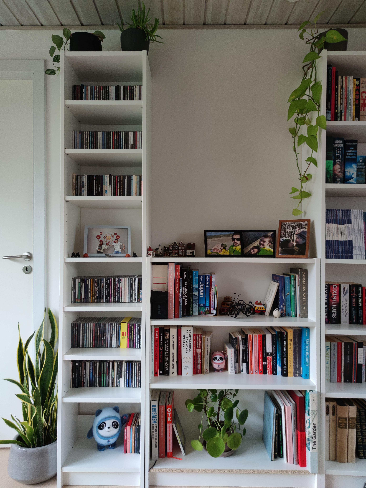
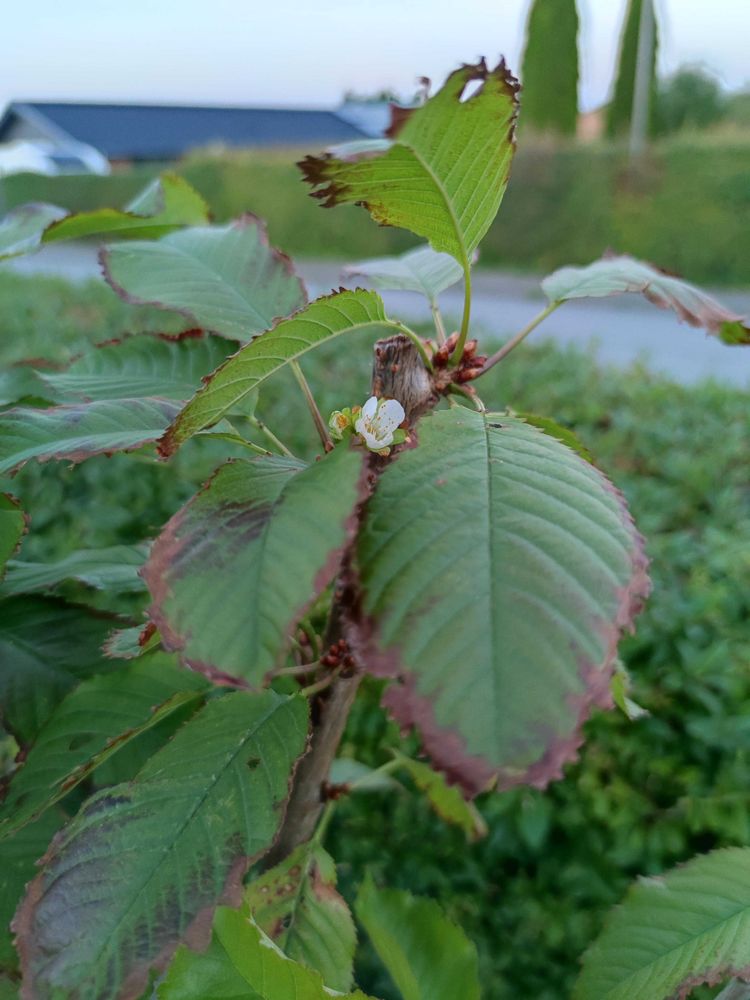
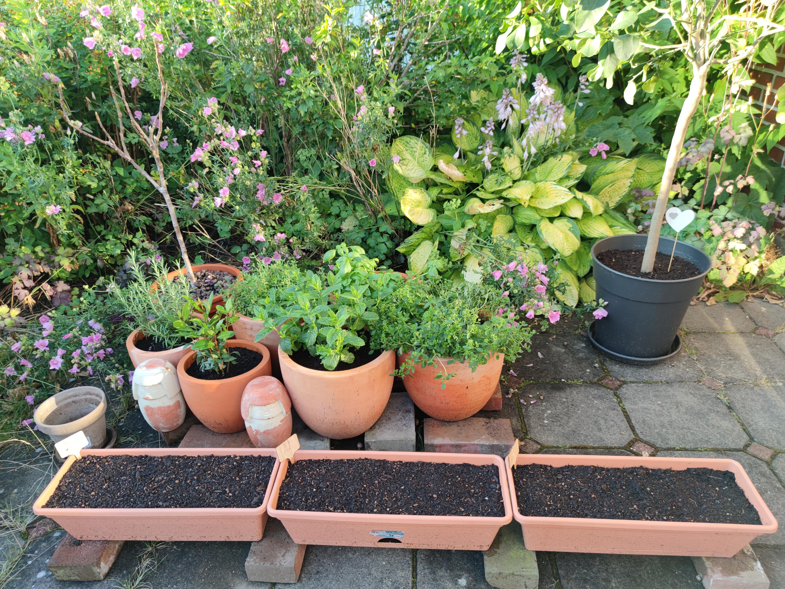

<html lang="en">
<head>
    <meta charset="UTF-8">
    <meta name="viewport" content="width=device-width, initial-scale=1.0">
    
</head>
<body>
    <header>
        <h1>Indoor plants</h1>
    </header>

        

        <h2>Openning thoughts</h2>
        
We have kept lots of indoor plants. Some of the plants are already with us or at least one of us for more than 5 years. We love our plants very much. Seeing their changes overtime become part of our joy in life.

            
            
Indoor plants

        

        

            
            
Greenhouse plants

        

        

            
            
Garden plants

        

    

</body>
</html>
