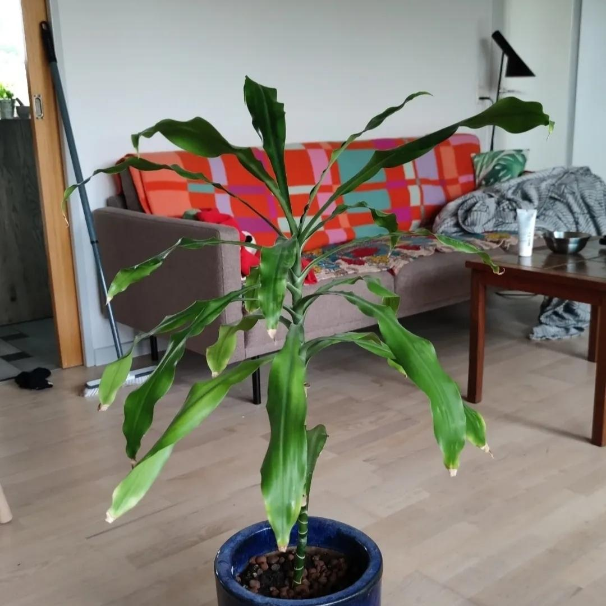

<html lang="en">
<head>
    <meta charset="UTF-8">
    <meta name="viewport" content="width=device-width, initial-scale=1.0">
    
</head>
<body>
    <header>
        <h1>Indoor plants</h1>
            <nav> 
                
We have lots of indoor plants. Some of the plants are already with us or at least one of us for more than 5 years! We love our plants very much. Seeing their changes overtime become part of joy in our life. 
                

            </nav>
    </header>

        
    

        <figure>
            
            
Alocasia (Regal shields)

            <figcaption>
            <ul style="list-style-type: none; padding-left: 0;">
                <li>Light: Partial sun</li>
                <li>Water: Unsure</li>
                <li>Soil: Chalky, Loam</li>
                <li>Fertilizer: August</li>
                <li>Pruning: Spring, Winter</li>
                <li>Difficulty: Moderate</li>
            </ul>
            </figcaption>
        </figure>
        <figure>
            
            
Aloe vera

            <figcaption>
            <ul style="list-style-type: none; padding-left: 0;">
                <li>Light: Partial sun</li>
                <li>Water: Unsure</li>
                <li>Soil: Succulent soil</li>
                <li>Fertilizer: Spring</li>
                <li>Pruning: No need </li>
                <li>Difficulty: Easy</li>
            </ul>
            </figcaption>
        </figure>
        <figure>
            
            
Bloodleaf

            <figcaption>
            <ul style="list-style-type: none; padding-left: 0;">
                <li>Light: Full sun</li>
                <li>Water: Unsure</li>
                <li>Soil: Potting/Peat moss mix soil</li>
                <li>Fertilizer: August</li>
                <li>Pruning: Spring, Summer, Autumn </li>
                <li>Difficulty: Moderate</li>
            </ul>
            </figcaption>
        </figure>
        <figure>
            
            
Chinese money plant

            <figcaption>
            <ul style="list-style-type: none; padding-left: 0;">
                <li>Light: Partial sun</li>
                <li>Water: Unsure</li>
                <li>Soil: Potting/Peat moss mix soil</li>
                <li>Fertilizer: August</li>
                <li>Pruning: Spring, Summer, Autumn </li>
                <li>Difficulty: Easy</li>
            </ul>
            </figcaption>
        </figure>
        <figure>
            
            
Common coleus

            <figcaption>
            <ul style="list-style-type: none; padding-left: 0;">
                <li>Light: Partial sun</li>
                <li>Water: Unsure</li>
                <li>Soil: Potting/Peat moss mix soil</li>
                <li>Fertilizer: Auguest</li>
                <li>Pruning: Spring, Summer, Autumn </li>
                <li>Difficulty: Easy</li>
            </ul>
            </figcaption>
        </figure>
        <figure>
            
            
Corn plant

            <figcaption>
            <ul style="list-style-type: none; padding-left: 0;">
                <li>Light: Partial sun</li>
                <li>Water: Unsure</li>
                <li>Soil: Potting/Peat moss mix soil</li>
                <li>Fertilizer: August</li>
                <li>Pruning: Winter </li>
                <li>Difficulty: Moderate</li>
            </ul>
            </figcaption>
        </figure>
        <figure>
            
            
Fairy castle

            <figcaption>
            <ul style="list-style-type: none; padding-left: 0;">
                <li>Light: Full sun</li>
                <li>Water: Unsure</li>
                <li>Soil: Succulent soil</li>
                <li>Fertilizer: Spring </li>
                <li>Pruning: Unsure </li>
                <li>Difficulty: Easy</li>
            </ul>
            </figcaption>
        </figure>
        <figure>
            
            
False christmas

            <figcaption>
            <ul style="list-style-type: none; padding-left: 0;">
                <li>Light: Partial sun</li>
                <li>Water: Unsure</li>
                <li>Soil: Succulent soil</li>
                <li>Fertilizer: Spring </li>
                <li>Pruning: Unsure </li>
                <li>Difficulty: Easy</li>
            </ul>
            </figcaption>
        </figure>
        <figure>
            
            
Golden barrel

            <figcaption>
            <ul style="list-style-type: none; padding-left: 0;">
                <li>Light: Full sun</li>
                <li>Water: Unsure</li>
                <li>Soil: Succulent soil</li>
                <li>Fertilizer: Spring</li>
                <li>Pruning: Unsure </li>
                <li>Difficulty: Easy</li>
            </ul>
            </figcaption>
        </figure>
        <figure>
            
            
Golden pothos

            <figcaption>
            <ul style="list-style-type: none; padding-left: 0;">
                <li>Light: Full shade</li>
                <li>Water: Unsure</li>
                <li>Soil: Potting/Peat moss mix soil</li>
                <li>Fertilizer: August</li>
                <li>Pruning: Spring, Summer, Autumn </li>
                <li>Difficulty: Moderate</li>
            </ul>
            </figcaption>
        </figure>
        <figure>
            
            
Green princess

            <figcaption>
            <ul style="list-style-type: none; padding-left: 0;">
                <li>Light: Partial sun</li>
                <li>Water: Unsure</li>
                <li>Soil: Loam, Sandy loam</li>
                <li>Fertilizer: August</li>
                <li>Pruning: Spring, Summer, Autumn </li>
                <li>Difficulty: Moderate</li>
            </ul>
            </figcaption>
        </figure>
        <figure>
            
            
Ladyfinger

            <figcaption>
            <ul style="list-style-type: none; padding-left: 0;">
                <li>Light: Full sun</li>
                <li>Water: Unsure</li>
                <li>Soil: Succulent soil</li>
                <li>Fertilizer: Spring</li>
                <li>Pruning: Unsure </li>
                <li>Difficulty: Easy</li>
            </ul>
            </figcaption>
        </figure>
        <figure>
            
            
Polka dot plant

            <figcaption>
            <ul style="list-style-type: none; padding-left: 0;">
                <li>Light: Partial sun</li>
                <li>Water: Unsure</li>
                <li>Soil: Potting/Peat moss mix soil</li>
                <li>Fertilizer: August</li>
                <li>Pruning: Spring, Summer, Autumn </li>
                <li>Difficulty: Easy</li>
            </ul>
            </figcaption>
        </figure>
        <figure>
            
            
Satin pothos

            <figcaption>
            <ul style="list-style-type: none; padding-left: 0;">
                <li>Light: Full shade </li>
                <li>Water: Unsure</li>
                <li>Soil: Potting/Peat moss mix soil</li>
                <li>Fertilizer: August</li>
                <li>Pruning: Spring, Summer, Autumn </li>
                <li>Difficulty: Moderate</li>
            </ul>
            </figcaption>
        </figure>
        <figure>
            
            
Spider plant

            <figcaption>
            <ul style="list-style-type: none; padding-left: 0;">
                <li>Light: Partial sun</li>
                <li>Water: Unsure</li>
                <li>Soil: Potting/Peat moss mix soil</li>
                <li>Fertilizer: August</li>
                <li>Pruning: Spring, Summer, Autumn </li>
                <li>Difficulty: Easy</li>
            </ul>
            </figcaption>
        </figure>
        <figure>
            
            
Variegated snake plant

            <figcaption>
            <ul style="list-style-type: none; padding-left: 0;">
                <li>Light: Full sun</li>
                <li>Water: Unsure</li>
                <li>Soil: Succulent soikl</li>
                <li>Fertilizer: Spring</li>
                <li>Pruning: Unsure </li>
                <li>Difficulty: Moderate</li>
            </ul>
            </figcaption>
        </figure>
    

</body>
</html>
